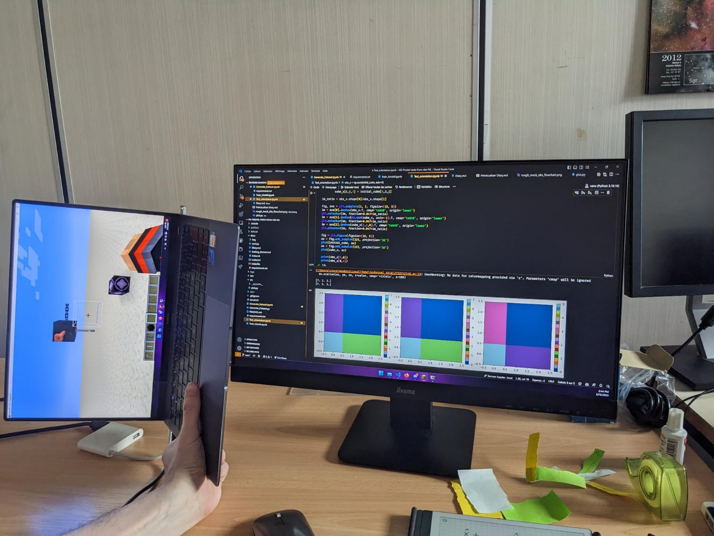

# 📜 Diary

## 01/02/2023

- Reading Barnabé Deforet's internship report
  - Tool to generate dendograms: AstroDendro
- Meeting with Julien Montillaud
  - Defined global strategy
  - **Step 1**: Search existing tools to implement 3D convolutive neural network
    - Found [CIANNA](https://github.com/Deyht/CIANNA) by David Cornu
    - Found Tensorflow.Keras.layers.Conv3D
  - **Step 2**: Generate simplistic models
  - **Step 3**: Implement 3D convolutive neural network
  - **Step 4**: Once it works, try to increase the complexity of the dataset to be more realistic (complexe shape, noise etc.)
  - **Step 5**: Implement [dropout](https://inside-machinelearning.com/le-dropout-cest-quoi-deep-learning-explication-rapide/) to have statistical results
  - **Step 6**: Use the model on real data

## 02/02/2023

- Created project flowchart to have a global vision of the project: 

- Having trouble with AMUSE installation... I spend the entire day on it, but I finally succeeded to install it.
  

  
Installation problems
 

  There was some additional dependencies to install and problem with deprecation of some functions used to build some modules, and after that there was still a problem that required to totally clear the cache of pip and reinstall all modules, so I don't really know which manipulation were usefull and which were not.

  

## 03/02/2023

- Getting familiar with Barnabé's code
- I need an access to the computation cluster in order to run Barnabé's code... waiting for it.
- Continuing reading Barnabé Deforet's internship report and articles about LOC and SOC

## 07/02/2023

- Reading Keras documentation and try to have a first rough neural network that work with any shapes of data (3D but with any size on each axis) for input and output
  - **Vocabulary: Batch size**: Number of samples per gradient update. If unspecified, batch_size will default to 32. Do not specify the batch_size if your data is in the form of datasets, generators, or keras.utils.Sequence instances (since they generate batches).
  - **Vocabulary: Channel**: A channel is a feature map. It is the last dimension in the data. For instance, in a grayscale image, the channel is 1, and in an RGB image, it is 3. In general, the channels axis is -1 for TensorFlow and Theano, and 1 for CNTK.
    - **What's the différence between 2D convolution on N channels and a 3D convolution on 1 channel?** The 2D convolution will treat all the channels independently, while the 3D convolution will treat all the channels together, so it will be more accurate to find schemes in the channel axis. Here, we want to extract relevant information from the difference between frequencies, so a 3D convolution looks a priori more relevant.
  - **Layer: MaxPooling3D**: Downsamples the input along its dimensions (depth, height, width) by taking the maximum value over the window defined by pool_size for each dimension along the features axis. The window is shifted by strides in each dimension. The resulting output when using "valid" padding option has a shape of:
    - output_shape = (input_shape - pool_size + 1) / strides
  - Got an idea of what to do while waiting to be able to generate huge physical simulations: make simplistic prestellar cores by using a gaussian repartition of the density and apply a plummer model on it to have a prestellar core base, then make it evolve a bit with some initial speed parameters before generating mock observations of it by simulating an artificial red shift. I will start this tomorrow.
  - Made the flowchart for this part: 

## 08/02/2023

- I did the simplistic prestellar core generation by using a slight different process than the original idea, here is the new flowchart: 

- There is still some verifications and probably improvements to ensure this model is not totally absurd before generating a huge dataset.
- Also, there is a problem concerning the view axis. I avoid heavy computation to make a true observation from a distant point of view by summing the 3D datacube along a dimension. But according to the dimension on which I sum, I need to rotate the input cubes accordingly to the point of view before saving them. As it is easier to say but tricky to do, I decided to use only one point of view. Thus, the orientation of the cubes has no importance because the AI will try to match a cube without considering the physical orientation of the system represented inside. With only one point of view, I'm sure that the relative orientation between the obervation and the output will be the same, and then avoid convergence issues.

## 09/02/2023

- Added normalization at several steps of the process to have better control of the output.
- Removed the central symtery by generating the initial lorentzian distribution in a bigger space and cropping this space after the fourier transform.
- Got access to the computation cluster and started to got familiar with it.
- Generated a 1000 items dataset
- Facing a problem of memory when I try to train the neural network do to the huge size of the NN hyperparameters (more than 68 Billions for inner dense layers). The problem seems that I need one neuron for each pixel or voxel, which becomes huges even for image or spaces of 64 pixels/vocal wide. Thus, I need to find another solution in literature that doesn't involve dense layers, or at least that solve the problem in some way.

## 10/02/2023

- Found a solution to train a classic neural network model, taking adventage of the local property of the problem. In fact, an output column depend only on the corresponding input column (and maybe some neighbors columns) and not on the entire datacube. So I can train a neural network that will be focused on a small windows of columns and will scan the datacube to get all output columns and rebuild the output datacube. Here is the flowchart of the idea: 

- Searched and found a solution to use Jupyter in VSC with a kernel hosted a computation node.
- Edited the function to generate the input/output vectors composed of columns insteade of entire images, but I'm facing a memory leak issue...
- Just thought to another problem: until now, I avoided the problem of orientation faced in the last part of the cloud generation process (see 08/02/2023). But as I'm now considering column (on the Z axis) at a specific X and Y coordinate, I need to ensure that all the axis are the same. Otherwise, I ask the AI to find the velocity and density profile along a line on X or Y (perpendicular to the line of sight) according to a spectrum for one given line of sight.

## 13/02/2023

- I think I solved the problem of orientation with a... let's say unconventional method 😅. I will finish to implement it and test it tomorrow. I then found this transformation (For the observer on negative axis, it's the same but with the reversed x' and z' coordinates):
  - For an observer on X+:
    - Vx'(x',y',z') = -Vz(y,z,x)
    - Vy'(x',y',z') = -Vy(y,z,x)
    - Vz'(x',y',z') = Vy(y,z,x)
  - For an observer on Y+:
    - Vx'(x',y',z') = Vy(x,z,-y)
    - Vy'(x',y',z') = -Vx(x,z,-y)
    - Vz'(x',y',z') = Vz(x,z,-y)
  - For an observer on Z+:
    - Vx'(x',y',z') = Vy(x,y,z)
    - Vy'(x',y',z') = -Vz(x,y,z)
    - Vz'(x',y',z') = -Vx(x,y,z)
  
  

  
The method (highly professional)

  
  As a remember of the problem: I have 3 cubes representing velocities along X, Y and Z axis for each space element (dimensions of the cubes correspond to space dimensions). The basis of Vx, Vy and Vz is classically oriented, but the space basis, guided by the index of the numpy array, is totally upside down. Moreover, I need a Vx', Vy' and Vz' in the basis of the observer... so that was a real multidimensional puzzle to solve.

  As I need to deal with 2 basis seen from a certain point of view, I first tryind to draw the problem... but without success. THen I tried with basis made with post-its, but no success neither. I needed to modelize the problem. As I don't master any 3D software to modelize it, I used the only kind-of 3D software I know: Minecraft, on wich I represented physically the basis used by numpy and the basis of the velocity vectors with their respective orientation. With numpy I designed a simple data cube conatining only 1 on (x,0,0), 2 on (0,y,0) and 3 on (0,0,z) and I sum this cube successively over each observation axis. By ploting the result, I was able to determine the orientation of the observer. After that, I put the player view in the corresponding orientation and I was able to see how Vx', Vy' and Vz' depend on Vx, Vy and Vz for each oservation axis. 

  *Credits: Thomas Ravinet cc-by-nc-sa*

  

- Discussed with Julien Montillaud and having now 2 new methods using NN to solve the problem which:
  - **The scanner**: The one I considered until now, consisting of scanning the input data cube with a small windows to get only the data of a line of sight as a result and reconstruct progressively the output data cube.

  - **The NCIS zoom**: Taking a very low resolution input cube, and then zooming on each child cube with always the same resolution.

  - **The Hourglass**: Taking the overhaul input cube as parameter and asking an AI to compress it as it can and then decompress it to get the output cube.

## 14/02/2023

- I made models of the 3 methods I discussed with Julien Montillaud in order to make them more explicit. The Machine Learning algorithm act only on the blue arrow, whil the rest is managed by a classical algorithm.

  - **The scanner**:  This method is the most simple one to implement and doesn't seem to have any difficult technical part. The only problem is that it is fully local, so it miss the global information. The more the windows will be large, the more the "global" information will be taken in account, but also the more the network will be expansive to train.

  - **The NCIS zoom**  By doing this diagram, I realized that the NCIS zoom method cannot be applied as easily as expected because either the output dimension has to change which is not possible, either it have to guess  N cubes with the same input, which can be made using probabilistic results and taking the N more probable ones... but there in addition to not be a bit wobly, these N cubes are not ordered so we cannot reconstruct the cube. It exist a solution with a huge counterpart: keeping the same depth low-resolution in output than in input (here 3).
  - **The Hourglass**:  This method is interesting because it conserve the global information, but I have a big doubt about the possibility of compressing enough the data to a reassonable size while conserving the ability to decompress it. In fact, this is very "organic" data, without redondancy. If in a simple model like the one I designed, it's easy to compress it by retrieving the parameters that was used to generate it, in a real case, there is no rule.

- While finishing to implement the orientation solution, I realized the I made a mistake in the orientation of the initial velocity cube. I then corrected it and I found a simpler transformation (once again, for X-, Y- and Z-, it's the same but with the reversed x' and z' coordinates):
  - For observation on X+
    - Vx'(x',y',z') = Vy(y,z,x)
    - Vy'(x',y',z') = Vz(y,z,x)
    - Vz'(x',y',z') = Vx(y,z,x)
  - For observation on Y+
    - Vx'(x',y',z') = Vx(x,z,-y)
    - Vy'(x',y',z') = Vz(x,z,-y)
    - Vz'(x',y',z') = -Vy(x,z,-y)
  - For observation on Z+
    - Vx'(x',y',z') = Vx(x,y,z)
    - Vy'(x',y',z') = Vy(x,y,z)
    - Vz'(x',y',z') = Vz(x,y,z)
- As the resulting spectrum was either gaussian-shaped either very noisy due to the gaussian shape of the initial spectrum distribution, I switch this profile, first to a voigt profile, then on a lorentzian one because the voigt profile was hundred of times heavier to generate than a similar lorentizan (and I'm still not searching for accuracy in this model). Now, after applying the red-shift, I get complexe spectra like this:  There is not the two expected pikes but it's normal. In fact, as the velocity is computed from the density gradient and as there is several local maximums, there is several idependant parts of the cloud that is getting closer to the observer at different speeds, and several others getting away. To minimize this effect, I applied a 3D gaussian profile on the density cloud an then I created a global maximum at the center. I then have either lorentzian-shaped profiles either very choatic ones, but it's a bit better because I can locally find these kind of profiles that show a rotation: 
- As the spectra are a bit chaotic, I will first try to train the model with the full spectra (100 points) instead of using 3 wavelenghts as it will be the case in the end. This reduction of spectra resolution will then be on of the parameters I will check to see he impact of the AI accuracy.
- My model is then ready, and I generated a dataset. I'm now trying to connect a Jupyter to the computation cluster before starting training the model.

## 15/02/2023

- I found a new mistake in the rotation transformation of the data cubes. As the mistakes comes directly from a way the numpy manage the exis, I designed a small 3D interactive plots to find the right transformation. On these plots, the big trihedron represent the initial space axis and the small on represent the initial velocity axis (blue for X, red for Y, green for Z). When we switch to the referential of the observer, Z goes outside the screen, so these trihedrons are rotated. Visually, the problem seems simple: from a X+ point of view, x become z', y become x' and z bcome y'. But as numpy is using a index system that doesn't correspond to space dimensions, the transformation are more subtiles.  I now (and finally I hope) have:
  
  

  | Observation axis | Vx'(x',y',z') | Vy'(x',y',z') | Vz'(x',y',z') |
  |------------------|---------------|---------------|---------------|
  | X+               | Vy(z,x,y)     | Vz(z,x,y)     | Vx(z,x,y)     |
  | Y-               | Vx(x,-z,y)    | Vz(x,-z,y)    | Vy(x,-z,y)    |
  | Z+               | Vx(x,y,z)     | Vy(x,y,z)     | Vz(x,y,z)     |
  | X-               | Vy(-z,-x,y)   | Vz(-z,-x,y)   | Vx(-z,-x,y)   |
  | Y+               | Vx(-x,z,y)    | Vz(-x,z,y)    | Vy(-x,z,y)    |
  | Z-               | Vx(-x,y,-z)   | Vy(-x,y,-z)   | Vz(-x,y,-z)   |

  

- I succeeded to start a VSC Jupyter on the computation cluster! I can now fully focus on the training phase!

## 16/02/2023

- Having trouble while trying to load the data set due to huge memory usage or huge processing time. I tested multiple solutions and I move forward but I'm still not able to load a full dataset due to anormal memory usage (about 100 times more than it should be).
- With the help of Thomas Ravinet, I think I found the origin of the problem: the native python list are incredibly heavier than numpy arrays. I then changed the way I store the data and it seems to load correctly. I will need to verify the inetegrity of the data and adapt the code this change.

