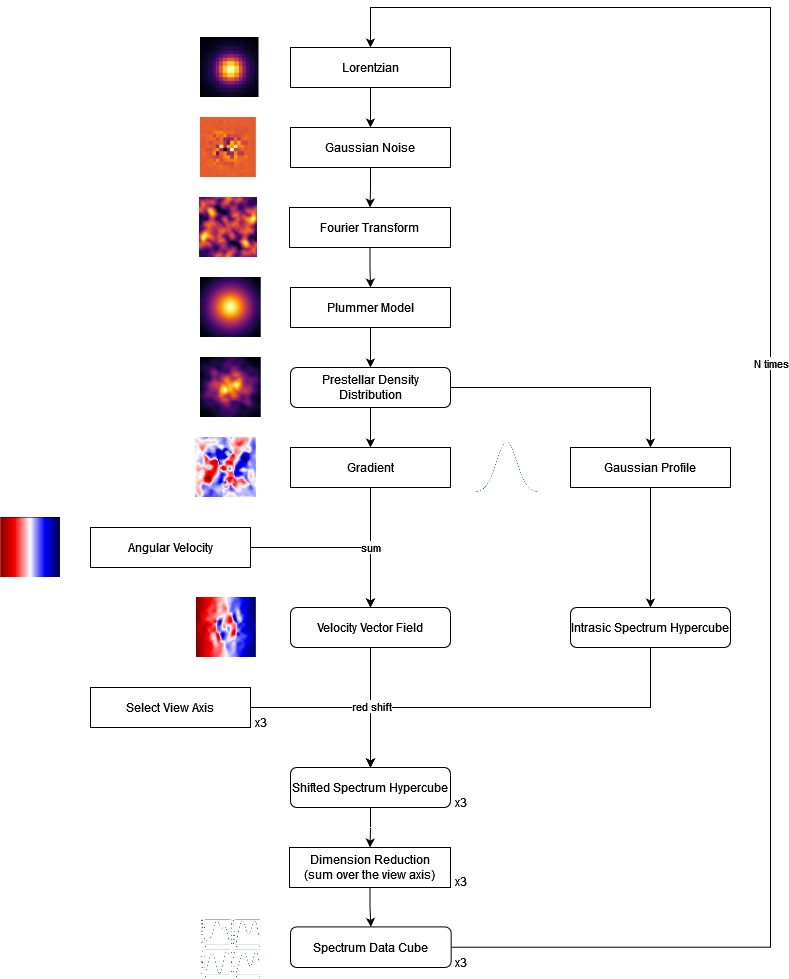

# 📜 Diary

## 01/02/2023

- Reading Barnabé Deforet's internship report
  - Tool to generate dendograms: AstroDendro
- Meeting with Julien Montillaud
  - Defined global strategy
  - **Step 1**: Search existing tools to implement 3D convolutive neural network
    - Found [CIANNA](https://github.com/Deyht/CIANNA) by David Cornu
    - Found Tensorflow.Keras.layers.Conv3D
  - **Step 2**: Generate simplistic models
  - **Step 3**: Implement 3D convolutive neural network
  - **Step 4**: Once it works, try to increase the complexity of the dataset to be more realistic (complexe shape, noise etc.)
  - **Step 5**: Implement [dropout](https://inside-machinelearning.com/le-dropout-cest-quoi-deep-learning-explication-rapide/) to have statistical results
  - **Step 6**: Use the model on real data

## 02/02/2023

- Created project flowchart to have a global vision of the project:

- Having trouble with AMUSE installation... I spend the entire day on it, but I finally succeeded to install it.
  

  
Installation problems
 

  There was some additional dependencies to install and problem with deprecation of some functions used to build some modules, and after that there was still a problem that required to totally clear the cache of pip and reinstall all modules, so I don't really know which manipulation were usefull and which were not.

  

## 03/02/2023

- Getting familiar with Barnabé's code
- I need an access to the computation cluster in order to run Barnabé's code... waiting for it.
- Continuing reading Barnabé Deforet's internship report and articles about LOC and SOC

## 07/02/2023

- Reading Keras documentation and try to have a first rough neural network that work with any shapes of data (3D but with any size on each axis) for input and output
  - **Vocabulary: Batch size**: Number of samples per gradient update. If unspecified, batch_size will default to 32. Do not specify the batch_size if your data is in the form of datasets, generators, or keras.utils.Sequence instances (since they generate batches).
  - **Vocabulary: Channel**: A channel is a feature map. It is the last dimension in the data. For instance, in a grayscale image, the channel is 1, and in an RGB image, it is 3. In general, the channels axis is -1 for TensorFlow and Theano, and 1 for CNTK.
    - **What's the différence between 2D convolution on N channels and a 3D convolution on 1 channel?** The 2D convolution will treat all the channels independently, while the 3D convolution will treat all the channels together, so it will be more accurate to find schemes in the channel axis. Here, we want to extract relevant information from the difference between frequencies, so a 3D convolution looks a priori more relevant.
  - **Layer: MaxPooling3D**: Downsamples the input along its dimensions (depth, height, width) by taking the maximum value over the window defined by pool_size for each dimension along the features axis. The window is shifted by strides in each dimension. The resulting output when using "valid" padding option has a shape of:
    - output_shape = (input_shape - pool_size + 1) / strides
  - Got an idea of what to do while waiting to be able to generate huge physical simulations: make simplistic prestellar cores by using a gaussian repartition of the density and apply a plummer model on it to have a prestellar core base, then make it evolve a bit with some initial speed parameters before generating mock observations of it by simulating an artificial red shift. I will start this tomorrow.
  - Made the flowchart for this part:

## 08/02/2023

- I did the simplistic prestellar core generation by using a slight different process than the original idea, here is the new flowchart:
  

- There is still some verifications and probably improvements to ensure this model is not totally absurd before generating a huge dataset.

## 09/02/2023

- Added normalization at several steps of the process to have better control of the output.
- Removing symtery by generating the initial lorentzian distribution in a bigger space and cropping this space after the fourier transform.